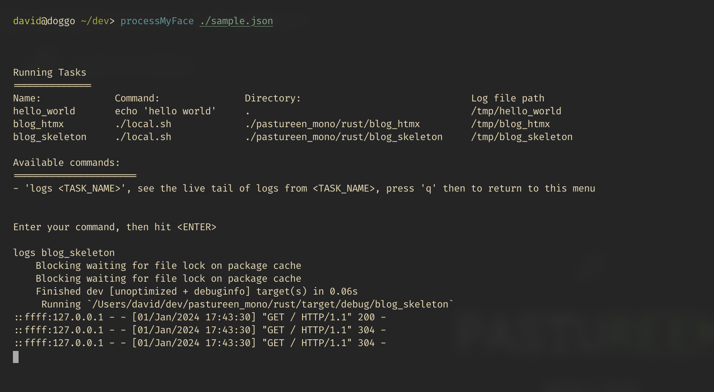

# ProcessMyFace

A quick and primitive utility to run multiple shell commands in parrallel 
and inspect their stdout logs.



## How to use

Tasks and commands are specified via a json file in this format

```jsonc
{
  "tasks": [
    {
      "command": "./start_server.sh", // The command to run
      "cwd": "../server_directory", // The directory to run it in (optional)
      "name": "blog_task" // The name of the task
    },
    {
      "command": "echo 'hello world'",
      "name": "hello_world"
    }
  ]
}
```

You can then specify the path to this json file.

```bash
processMyFace ./path/to/json/file.json
```

## Caveats

For demo and personal use, not very refined, only works on MacOs currently I think.
